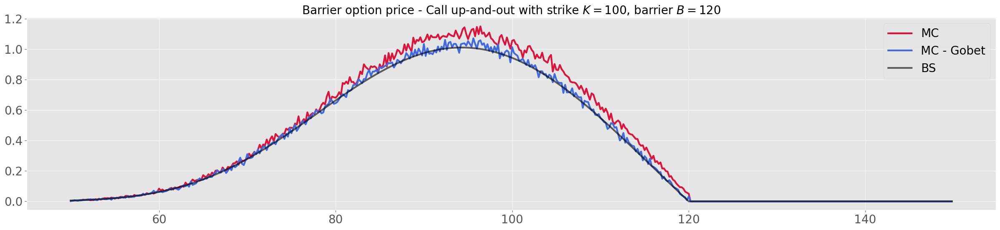

# Killed diffusion and pricing path-dependent options

We implement a discrete and a continuous Euler scheme to compute payoffs of the form $$\mathbb{E}\left[\mathbb{1}_{T < \tau} f(X_T)\right],$$ where $$\tau \coloneqq \inf {t > 0 : X_t \notin D }$$ is a stopping time for when the diffusion exits a domain $D$.



# TO-DOs

- [ ] Vérifier si p(z1, z2, T/N) ou 1-p(z1, z2, T/N) pour les options barrières
- [ ] Illustrer la convergence de nos prix Monte Carlo vers ces formules fermées (quand la closed formula existe) (faible + forte ?)
- [ ] Dev une fonction générique pour un drift / diffusion plus complexe que Black Scholes mais toujours similaire à l'article (cf. la dynamique générale posée par Gobet en introduction)
- [ ] Pour aller + loin : Dev du pricing Monte Carlo pour des barrières en dimension supérieure à 1 -> tester des barrières plus complexes (cf. l'article de Gobet et ses conditions H1, whatever...) (approfondissement ?)


# Notes

To expose the C++ functions in Python through the killed_diffusion module, we run the following command:

```console
g++ -O3 -Wall -shared -std=c++11 -fPIC -Wl,-undefined,dynamic_lookup `python3 -m pybind11 \
--includes` src/closed_formula.cpp src/montecarlo.cpp src/wrapper.cpp -o \
killed_diffusion/killed_diffusion`python3-config --extension-suffix`
```